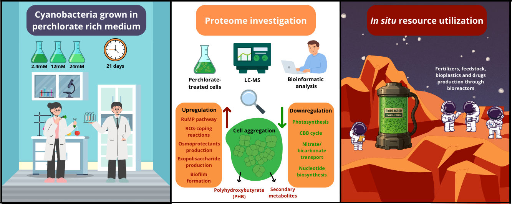

# Chroococcidiopsis_029_Perchlorates_proteomics
This is the repository containing the code, files, and results of the paper "Proteomics of long-term response of the desert cyanobacterium _Chroococcidiopsis_ sp. CCMEE 029 in perchlorate-rich medium and its implications for in situ resource utilization on Mars"

